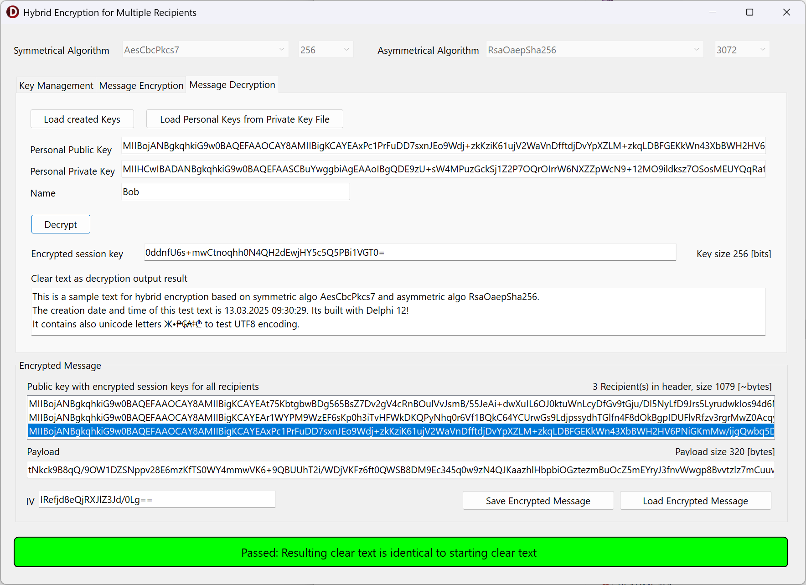

# WinRTCrypto
Four simple applications written for Delphi give an introduction to Symmetric Encryption with AES, Aysmmetric Encryption with RSA and Hybrid Encryption as a combination of the two technologies. 
All code based on pure Delphi using the WinApi.WinRT and Winapi.Security.Cryptography Library delivered since Delphi 10 Seattle. 
No 3rd party library is required. 
This code runs on Windows only and therefore uses the VCL.

The sample projects are developed and prepared for Delphi 11.3 Alexandria.

Delphi is a registered trademark of Embarcadero Technologies, Inc.

Christoph Schneider 
Schneider Infosystems Ltd  
September 2023
