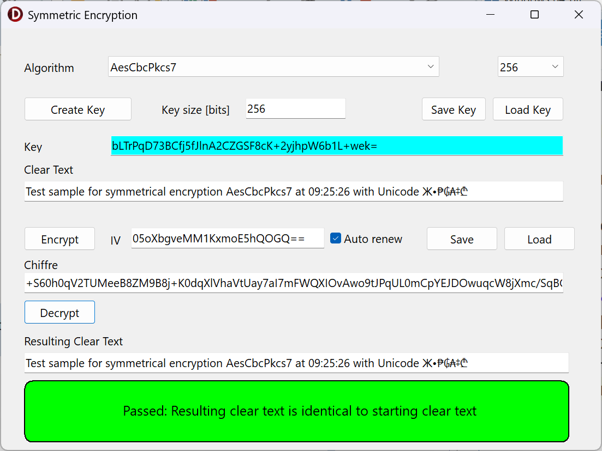
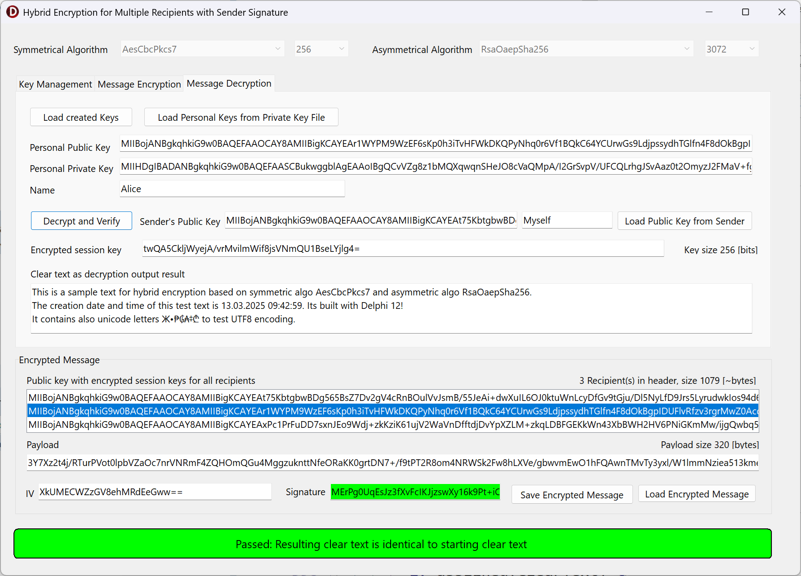

# WinRTCrypto
Five sample applications written for **Delphi** provide an introduction to symmetric encryption with AES, asymmetric encryption with RSA and hybrid encryption as a combination of both encryption algorithms and sign and verification. 
All code based on pure Delphi using the _WinApi.WinRT_ and _Winapi.Security.Cryptography_ library delivered since Delphi 10 Seattle. No additional 3rd-party libraries are required. 
This code only runs on Windows and therefore uses the VCL.

# Introduction to asymmetric encryption with RSA algorithms

This first sample app demonstrates how easy it is to use asymmetric encryption for small messages.
For this purpose, the application provides different variants of the RSA algorithm. The key length can also be selected.
The maximum message length is limited by the length of the key.

# Introduction to symmetric encryption with AES algorithms

This second sample app demonstrates how easy it is to use symmetric encryption for longer real messages.
For this purpose, the application provides different variants of the AES algorithm. The key length can also be selected.
For CBC block encryption, an additional initial vector is required, which must be re-ciced for each encryption.
The message length has to be a multiple of the block length. To do this, the message needs to be padded. The PKCS7 padding algorithm makes this safer than using a constant character as a filler.

# Combination of symmetric and asymmetric encryption within the hybrid encryption 

This third sample app demonstrates how to encrypt a message with the public key of the receiver of this message. 
The appropriate private key of the receiver is used for subsequent decryption. 
With each encryption, a new session key is generated to symmetrically encrypt the entire message. 
Only this session key is encrypted and decrypted by asymmetric algorithms. 

# Hybrid encryption for several recipients of the same message 

The fourth sample app expands the previous sample app by allowing decryption by more than one recipient.

For several recipients, the session key is encrypted asymmetrically with their public keys and appended to the message.

# Hybrid encryption for several recipients with sender signature 

The fiveth sample app expands the previous sample app by adding a sender signature to the message. 
When decrypting, this signature is used to check whether the message was created by the sender with the public key known to me.  

The sample projects are developed and prepared for Delphi 12.3 Athena.

Delphi is a registered trademark of Embarcadero Technologies, Inc.

Christoph Schneider, Schneider Infosystems AG, Switzerland
[www.schneider-infosys.ch](https://www.schneider-infosys.ch)
