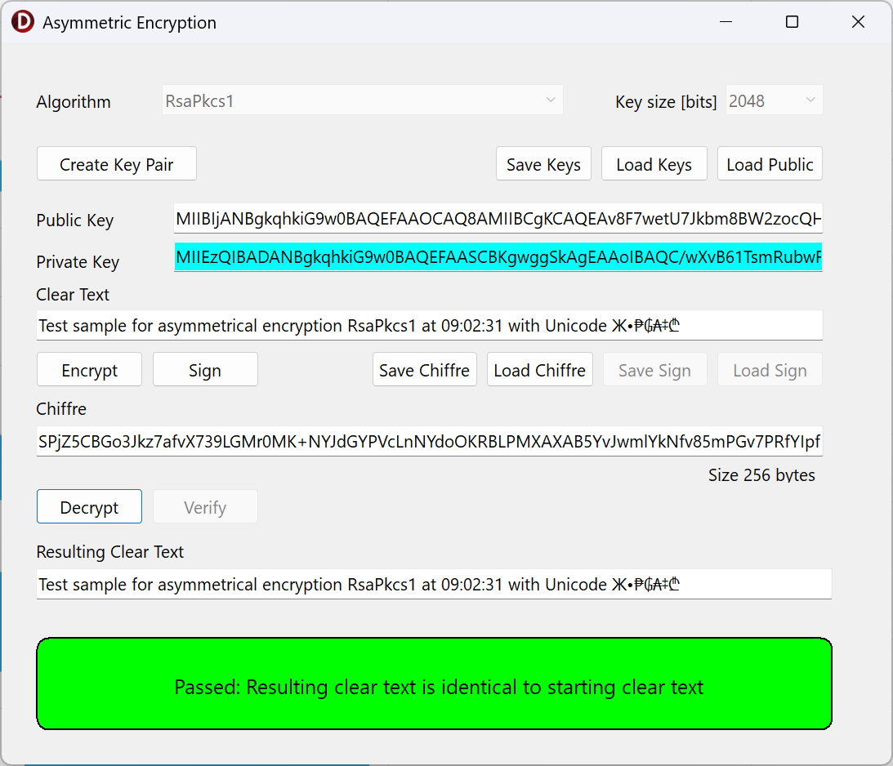
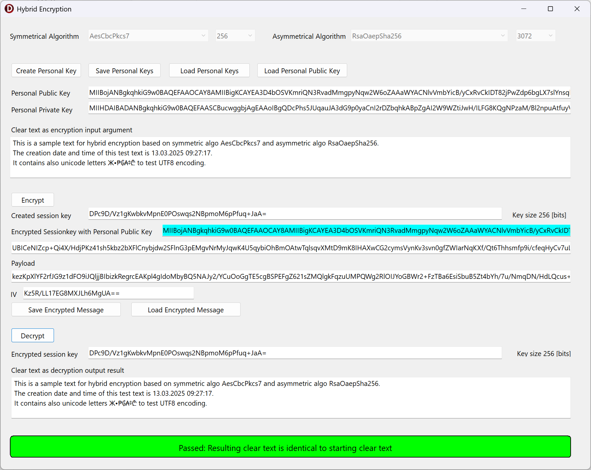

# WinRTCrypto
Four simple applications written for Delphi give an introduction to Symmetric Encryption with AES, Aysmmetric Encryption with RSA and Hybrid Encryption as a combination of the two technologies. 
All code based on pure Delphi using the WinApi.WinRT and Winapi.Security.Cryptography Library delivered since Delphi 10 Seattle. 
No 3rd party library is required. 
This code runs on Windows only and therefore uses the VCL.

# Introduction to asymmetric encryption with RSA algorithms

This first sample app shows how easy it is to use asymmetric encryption for small messages.

# Introduction to symmetric encryption with AES algorithms

This second sample app shows how easy it is to use symmetric encryption for longer real messages.

# Combination of symmetric and asymmetric encryption within the hybrid encryption 

This third sample app shows how to encrypt a message with the public key. 
The appropriate private key is used for subsequent decryption. 
With each encryption, a new session key is generated to symmetrically encrypt the entire message. 
Only this session key is encrypted and decrypted by asymmetric algorithms. 

# Hybrid encryption for several recipients of the same message 

The last sample app expands the previous sample app by allowing decryption by more than one recipient.

For several recipients, the session key is encrypted asymmetrically with their public keys and appended to the message.

The sample projects are developed and prepared for Delphi 11.3 Alexandria.

Delphi is a registered trademark of Embarcadero Technologies, Inc.

Christoph Schneider 
Schneider Infosystems Ltd  
September 2023
